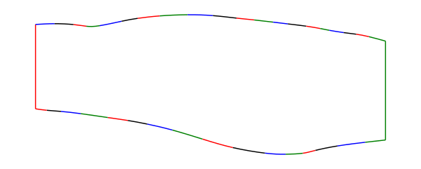

# bezier2arc

A program for modifying an SVG file containing line segments and cubic 
Bezier curves. Each cubic Bezier curve is approximated by a series of arc such
that the maximum distance between the original Bezier spline and the arcs is less than a predefined tolerance.
In addition, there is a lower limit to the radii of the arc segments that are 
used in the approximation. This is a constraint of some CNC machines.

This conversion program is useful when dealing with CNC programs 
that cannot handle Bezier curves.

The direct conversion to dxf format is planned but not yet implemented.

## Prerequisites

- svgpathtools
- numpy
- ezdxf
- scipy

## Setup

```bash
$ python setup.py install
```

## Credit

The program borrows heavily from examples provided with the 
package [svgpathtools](https://github.com/mathandy/svgpathtools).
The iterative spline fitting logic is similar to the one described in
[A Primer on Bézier Curves](https://pomax.github.io/bezierinfo/).

## Usage

```bash
# list all paths and segments in original file
$ python -m bezier2arc --list -i input.svg

# color the segments - useful for identifying errors in input file
$ python -m bezier2arc --color -i input.svg -o colored-input.svg

# convert to bezier splines to arcs, with minimum radius=50
# and maximum error=2
# units are the units of the input file
$ python -m bezier2arc --convert -i with-splines.svg -o with-arcs.svg -r 50 -d 2

# ... verify result
$ python -m bezier2arc --list -i with-arcs.svg
```

## Examples

Color each segment of a svg file
```bash
$ python -m bezier2arc --color -i ./data/table-1-spline.svg -o table-1-spline-colors.svg
```



License
-------

This module is under a MIT License
